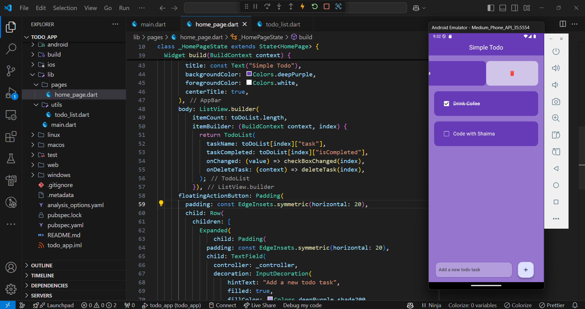

# Flutter Todo App

A simple and lightweight Todo app built with Flutter. Manage your tasks efficiently with features like adding, completing, and deleting tasks.

## Features

- Add new tasks.
- Mark tasks as completed.
- Swipe to delete tasks.

## Getting Started

```bash
git clone https://github.com/your-username/flutter-todo-app.git
cd flutter-todo-app
flutter run

```


